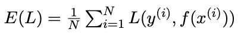
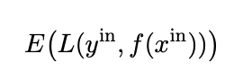
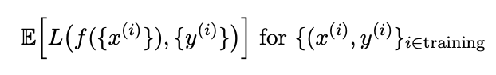
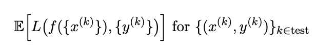

### 1. Setting up the problem
Here, we give a description of the process that supervised learning entails. To this end, we start with giving a brief summary of the typical workflow starting with some data. 

The first step is do some exploratory data analysis, to get an idea and overview of what the data contains, but also to conduct a clean-up (e.g. eliminate empty fields, other unusable pieces of data). 

Then we decide on the variables to use in the analysis as well as the task. This initial examination of the problem is crucial and encapsulates much of the modelling aspects of the work (i.e. trying to establish associations between variables and observables and create a model that allows us to predict the observable given new data points. Formally, this will lead to a declaration of the predictor space X and the outcome space Y. Both can be either continuous (i.e. quantitative) or discrete (e.g., categorical). 

Then we define the samples that we use for the training task, i.e. $x^{(i)} ∈ X$, as well as $y^{(i)} ∈ Y$. At this point, we will also have to keep some samples aside for validation, the remaining data will constitute the training set. 

Now, for a given task with training set ${(x^{(i)},y^{(i)})}^N_{i=1}$, we want to find the function $f : X → Y$, whilst defining the loss function $L f(x), y$. The loss function can sometimes be thought of as a function that computes the error between the model’s estimates and the ground truth.

### The basic process for supervised learning is as follows:

(1) Start with data $(x^{(i)}, y^{(i)}), i = 1, . . . , N$.

(2) Decide: Classification or regression?

(3) Define a loss function $L(y, f(x))$

(4) Minimise the mean sample loss: 

(5) Try to also achieve a reasonable expected test loss: 

 
In general, the solution for $f$ will be the result of some form of optimisation, minimising the in-sample loss (error) $L$. That is to say, we are aiming to minimise the following: 

 
However, we also want to avoid over-fitting, i.e. obtaining a model that fits the training data perfectly, but will not perform well on unseen data. This means that we need to ensure that the expected out-of-sample loss test is also small: 

This desirable property is also known as *generalisability*.

In addition, there are usually several hyperparameters in the models. These parameters are called ‘hyper’ because typically they specify the overall structure of the model or the algorithm. These are parameters that are chosen and remain fixed during the optimisation that is done on the training set. 

To try and avoid overfitting and to enhance generalisability of our models to predict on unseen data, it is customary to calibrate the hyperparameters on the results (a *hyperparameter search*), using a subset of the samples called the *validation set*.

The model trained on the training set with a particular choice of hyperparameters is used to predict the outcomes on the validation set. And this process is repeated with different values of the hyperparameters. 

This scanning (or optimisation) over the hyperparameters fulfills a double function: finding the optimal combination of hyperparameters, and providing us with some reassurance that the model is robust and has the potential to generalise well. 

After this validation step, we will choose a model with an optimised set of hyperparameters with good performance and robustness. This model is then used on the test data, which has not been used at all in the optimisations of parameters or hyperparameters.
