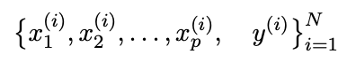
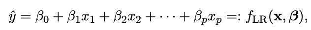
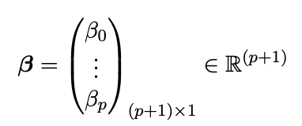
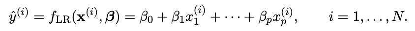
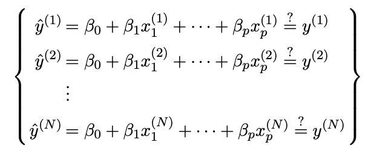
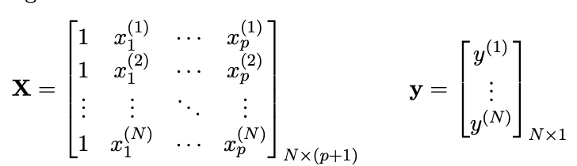
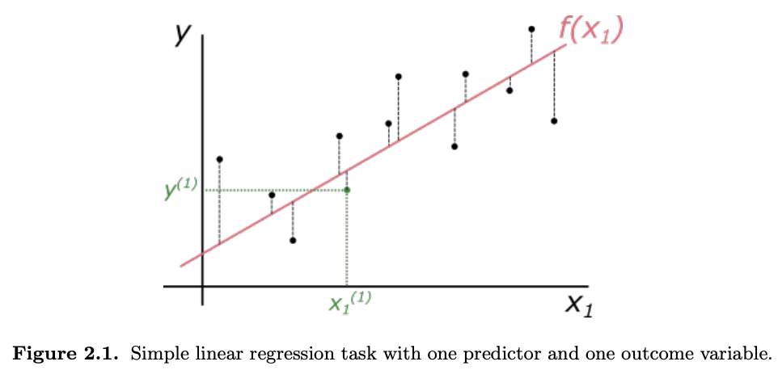
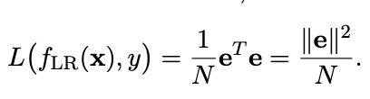
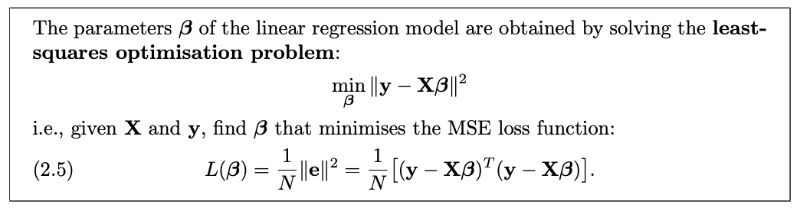

### Linear regression and the Normal Equation

In the case of linear regression, we assume that our observations follow a linear relationship with respect to the input variables. This assumption could be based on some prior knowledge about the data; it could follow from our exploratory data analysis; or it could be based on a known model with a basis in physics, biology, economics, etc. 

For simplicity we will restrict ourselves to the case where the observable variable is univariate and real: $y^{(i)} ∈ R$.

The data will look like: 

We then write the following linear model for our observations: 

where the vector $β$ contains the $(p + 1)$ parameters of the model, which need to be found from the training data. 

For every point in our data, we will then have a predicted value

Ideally, we would want to find the values of the parameters $β$ such that the prediction $\hat{y} (i)$ is equal to the observation $y (i)$ for every single data point:

Linear regression solves the least squares problem, essentially it finds a set of parameters such that our predictions are close to the observations in a precise sense. To see how this problem is solved in generality, we rewrite the above in matrix-vector form. Where matrix $X$ contains the descriptor variables and vector $y$ contains the observed variables:

So $N × 1$ vector of predicted values $\hat{y}$ is given by: 
    $\hat{y} = Xβ$

Since we want to find the parameters such that prediction and observations are close, we need to quantify the error of our model: 
    $e = y − \hat{y} = y − Xβ$. 

The error is illustrated in Figure 2.1. The vector $e_{N×1}$ contains all the deviations between the predicted values and the observed outcomes.

Least squares finds a solution of an associated system that minimises the mean squared error (MSE). In our matrix-vector notation, the MSE can be written compactly as: 

The linear regression model that minimises the MSE is obtained by solving this least-squares problem

To understand what this least squares solution means we need to perform an optimisation which can be solved both explicitly and numerically, these proofs are outside our scope for now. 
 