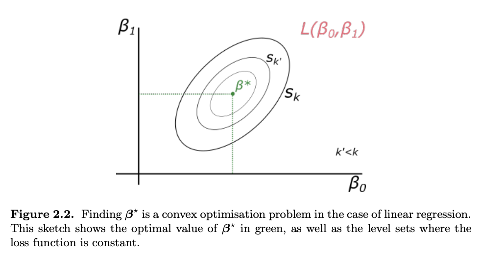
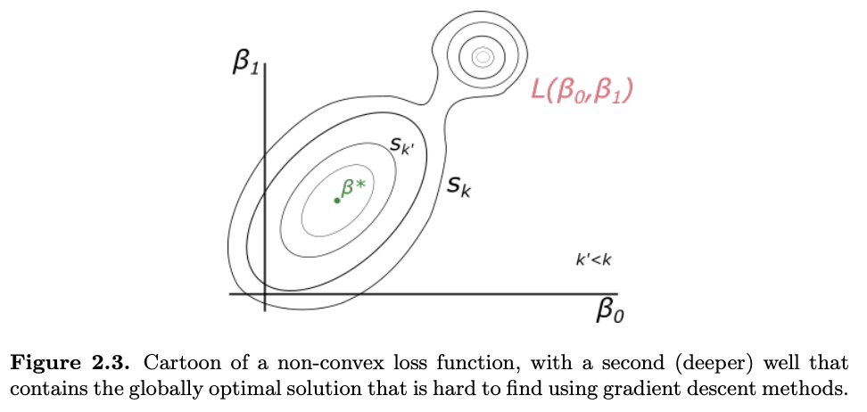

### Optimisation with Gradient Descent

In the previous sections, we optimised the loss (or the likelihood) of the linear regression problem by minimising $L(β) = 1/N (y − Xβ)^T(y − Xβ)$ over the space of $β$.

We showed that this function (a quadratic) is convex and has a unique minimum, given by the Normal Equation. In some cases, X may become huge and inverting big matrices may become computationally infeasible or  the minimum of the loss function cannot be found analytically. That is to say, one would not be able to solve $∇_βL|_{β^*} = 0$ explicitly. 

Gradient descent is an algorithm that numerically estimates where a function outputs its lowest values. Since the gradient of a multivariate function gives the direction of maximum variation, following the gradient will maximise the function at every point (so minimising is done by changing signs).

The above approach will always take us to a local maximum (or minimum) but once we are at that point, the gradient is zero and we stop moving. However, we will not know if the maximum we found is the global maximum of the function unless we have extra conditions.

To get some intuition, Figure 2.2 illustrates the loss function, with lines indicating the sets of points where the loss function has a constant value. In this particular case, the ellipses are concentric and as we decrease k we move closer to the optimal point $β^⋆$ .

The loss function is non-convex, meaning it has multiple local minima, which makes it difficult for gradient-based methods to find the global minimum. Figure 2.3 shows that choosing an initial guess at random for the parameter set $β$ will likely result in convergence to a local minimum. However, there is another deeper minimum (the global optimum) that is harder to reach. This is a common problem in complex models beyond linear regression, and there are methods to address it, but no perfect or even good solutions exist.

