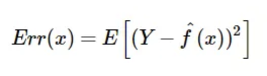
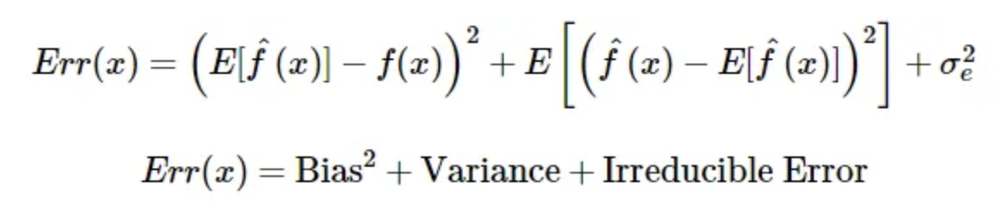
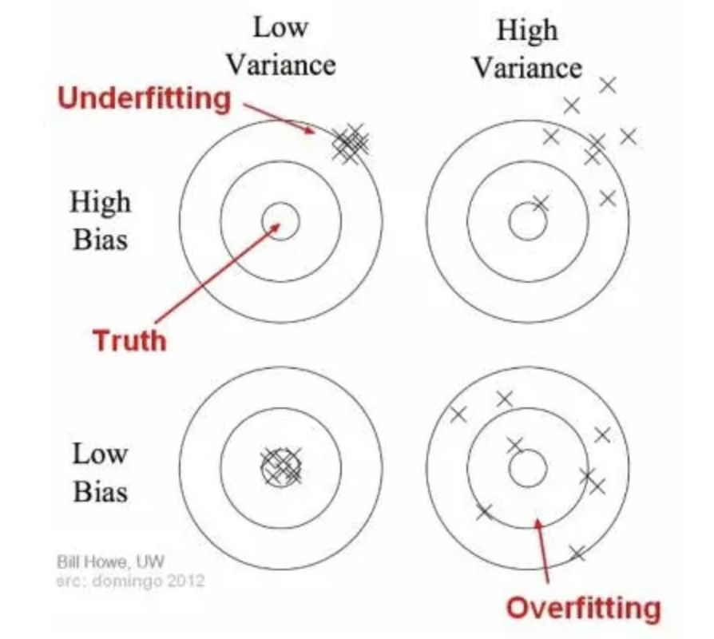
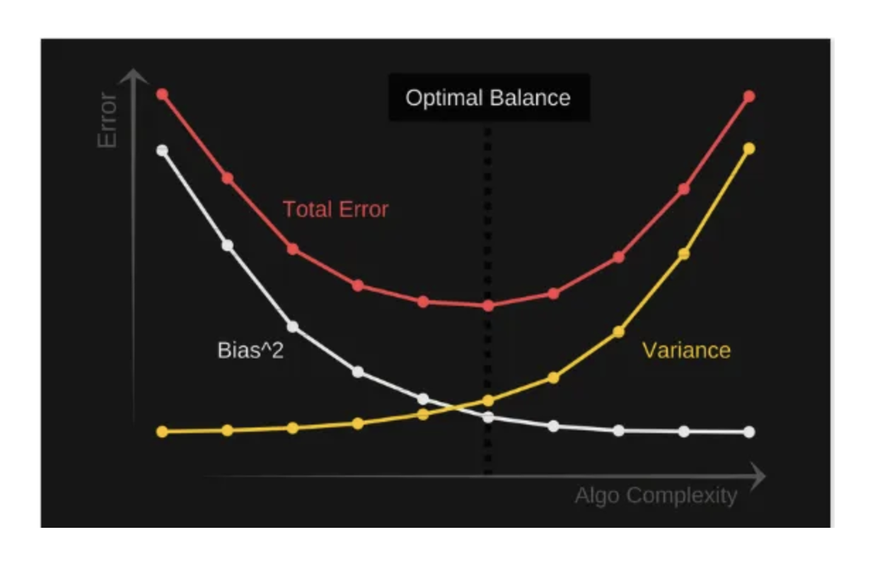

### VBias vs Variance 

In machine learning, bias and variance are two important concepts that are used to describe the performance of a model. Bias refers to the difference between the predicted values and the actual values, while variance refers to the amount of variability in the predicted values when the model is trained on different datasets.

Bias represents the simplifying assumptions made by a model to make the target function easier to learn. In other words, it is the difference between the expected value of the predictions and the true values. High bias models are generally less complex and more likely to underfit the data, resulting in poor performance on both the training and testing datasets.

Variance, on the other hand, refers to the amount by which the predicted values vary from the expected value when the model is trained on different datasets. Models with high variance are overly complex and tend to overfit the training data, resulting in poor performance on the testing dataset.

The bias-variance trade-off is a fundamental concept that involves finding the right balance between bias and variance to achieve the best performance on new, unseen data. A good model should have a balance between bias and variance that minimizes the overall error.

To achieve this balance, various techniques can be used, including regularization, feature selection, and model selection. Regularization techniques like Lasso and Ridge regression can be used to reduce variance and increase bias, while feature selection can help to reduce the complexity of the model, reducing variance. Model selection techniques like cross-validation can be used to find the optimal balance between bias and variance for a given problem.

### Mathematically 
Given we are trying to predict some variable $Y$ with our covariates $X$, we assume there is a relationship between the two such that: 

$Y=f(X) + e$

    Where e is the error term and it’s normally    distributed with a mean of 0.

Using Linear Regression or any other modelling technique we have a model $\hat{f}(X)$ such that the expected squared error at point $x$ is: 

Expanding our expected error into it's components we get definitions for bias, variance and irreducible error. Irreducible error is a measure of the amount of noise in our data, no matter how performant our model is, data will always have a certain amount of noise or irreducible error that cannot be removed: 

